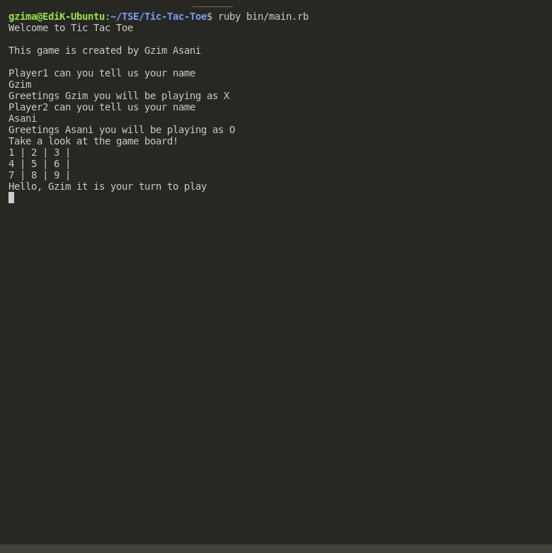

# Tic-Tac-Toe
# The Tic-Tac-Toe
>The purpose of this project was to demonstrate our learned skills on writing creating and writing test cases for Ruby programming. Here I created a a well known Tic-Tac-Toe game

In this project we created the spec directory which houses the player_spec.rb and game_spec.rb class in their respective file that is being tested

## Build with

- Ruby
- RSPEC
- VSCode
- Rubocop

## Getting Started

In order to test the game locally follow the next steps

### Prerequisites

To get this project up and running, you must have Ruby installed on your machine.

### Install

1. Clone the repo into your machine
    $ https://github.com/GzimAsani/Tic-Tac-Toe.git

2. Cd into Tic-Tac-Toe-Game directory

3. run rspec --init

4. Cd into the spec directory, create the game_spec.rb and player_spec.rb file. 

5. Require the needed files, write your test, run rspec to check if the test passes.

6. Run rubocop on your working folder and fix errors.

6.  stage, commit, push to the created remote branch(tic_tac_toe_test) on github and create a pull request..

## Contents
The code is divided in two main folders **./lib**  and **./spec**.
The main executable code **game_spec.rb and player_spec.rb**  are in **./spec**. The other folder contains other important classes which were incorporated in the **game_spec.rb and player_spec.rb**

# Authors

👤 **Eric Enaburekhan**

- Github: [Gzim Asani](https://github.com/GzimAsani)
- Linkedin: [Gzim Asani](https://www.linkedin.com/in/gzim-asani/)

## 🤝 Contributing

Our favourite contributions are those that help us improve the project, whether with a contribution, an issue, or a feature request!

Feel free to check the [issues page](https://github.com/GzimAsani/Tic-Tac-Toe/issues) to either create an issue or help us out by fixing an existing one.
